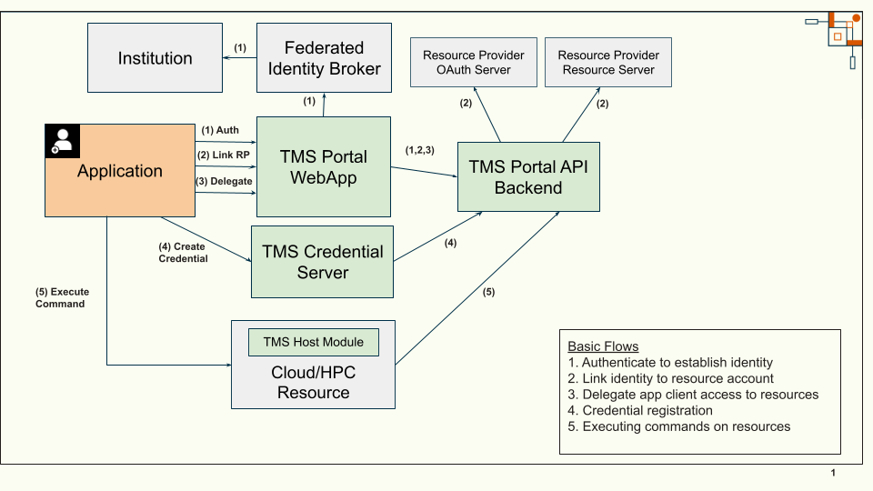
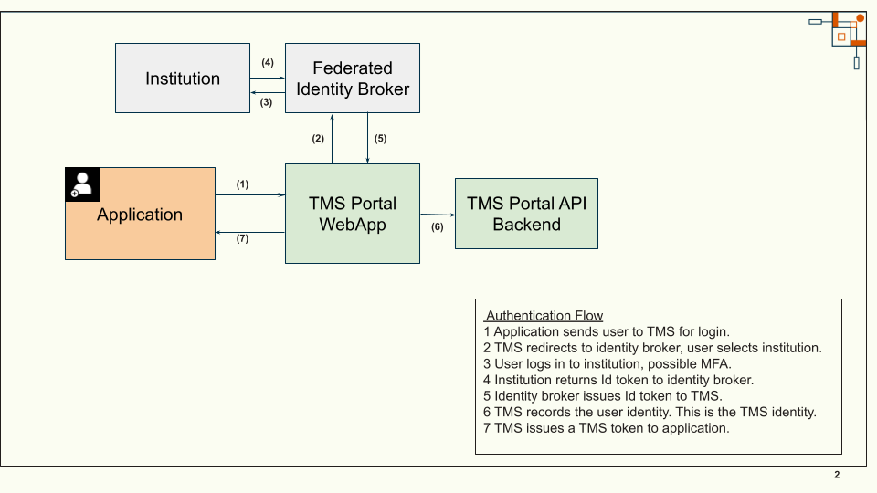
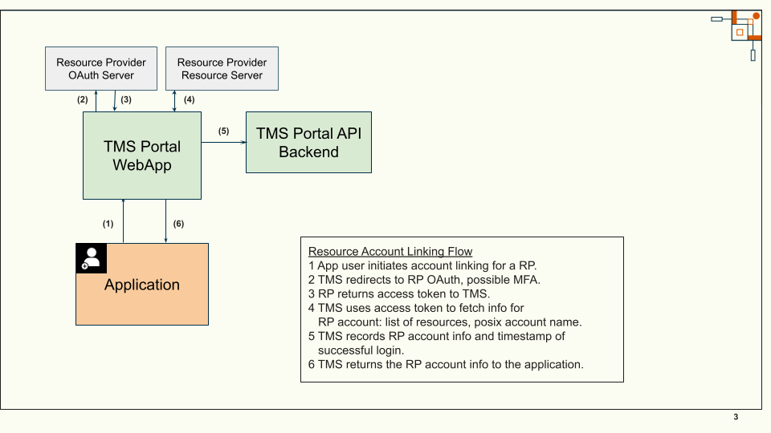
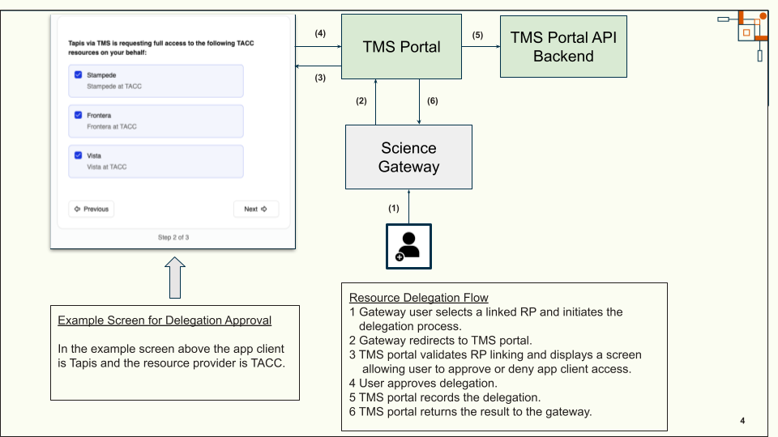
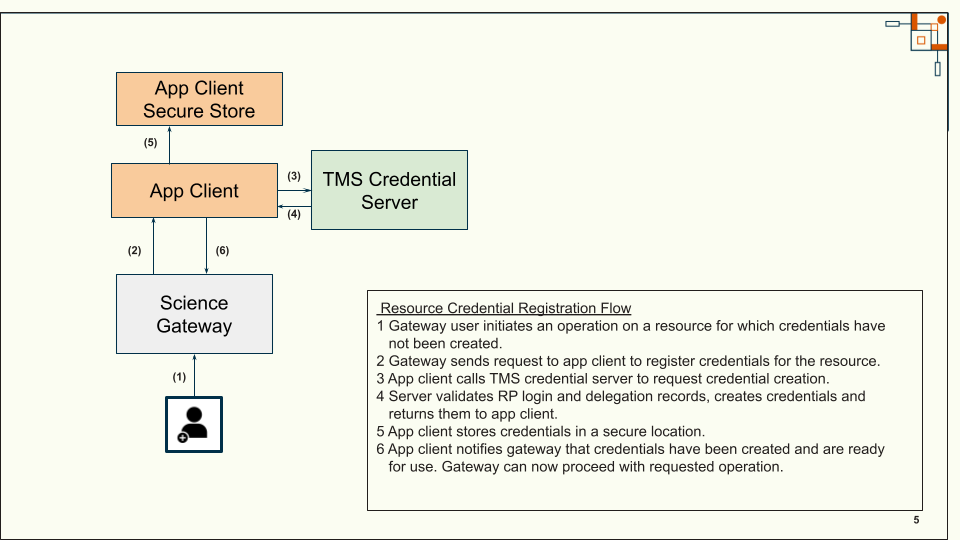
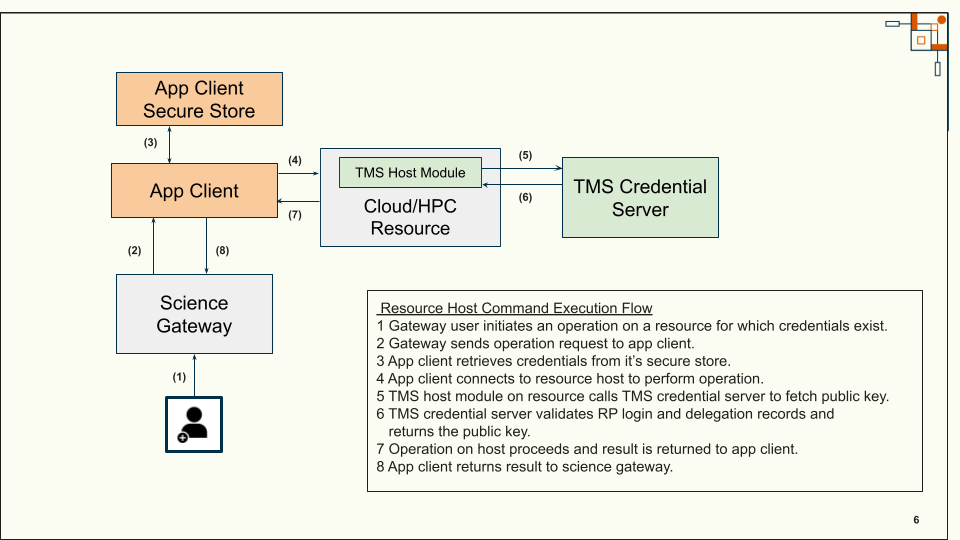

..
    Comment: Heirarchy of headers will now be!
    1: ### over and under
    2: === under
    3: --- under
    4: ^^^ under
    5: ~~~ under

.. raw:: html

    

.. role:: red

###########################
Architecture
###########################

.. warning::
  **UNDER CONSTRUCTION**

Terminology
===========

To understand the TMS architecture, it is useful to establish definitions for the various
components comprising TMS as well as the external components with which TMS will interact:

*Application Client*
  An application that will make use of TMS for credential management. TMS will be used
  to allow an application user to delegate access to resource provider accounts.
*Federated Identity Broker*
  Service supporting federated login, e.g., *Globus* or *CILogon*. This is the service
  used by TMS to allow users to log in through their institution, such as a university or
  research center.
*Resource Provider (RP)*
  A cyber-infrastructure provider supporting OAuth login and providing one or more resource hosts.
  Examples of such providers are the Texas Advanced Computing Center (TACC), the San Diego
  Supercomputer Center (SDSC), the Pittsburgh Supercomputing Center (PSC) and the National Center
  for Supercomputing Applications (NCSA).
*Resource Provider OAuth Server (RPOS)*
  An OAuth server for a resource provider.
*Resource Provider Resource Server (RPRS)*
  A REST API service available at a resource provider allowing for the retrieval of resource metadata
  associated with a user account.
*Resource*
  The host provided by a resource provider, such as *stampede3@tacc*, *expanse@sdsc*.
*TMS Portal WebApp*
  A web-based application allowing a user to link their institutional identity to a resource
  provider and approve (i.e. delegate) an application client to act on their behalf when interacting
  with those resource providers.
*TMS Portal API Backend*
  A back-end REST API service supporting OAuth login, RP linking and resource delegation initiated
  by the TMS Portal WebApp.
*TMS Credential Server*
  The TMS back-end REST API service supporting SSH key-pair generation and SSH public key lookup.
*TMS Host Module*
  A TMS program on the resource host that is executed when a resource account user attempts to
  login to the host using SSH. The program is also referred to as TMS KeyCmd. This module makes
  calls to the TMS Credential Server.
*Science Gateway*
  A web-based application that acts as a client to TMS and hides some of the complexity of TMS in order
  to provide a better user experience.

The TMS components are the TMS Portal WebApp, Portal API Backend, Credential Server and Host Module.
The other components are the entities with which TMS will interact.

Basic Flows Supported by TMS
============================

TMS supports flows related to authentication, resource account linking, resource delegation and
remote command execution.

*Authentication*
  A user establishes their identity by logging in to their institution through the TMS Portal WebApp.
*Resource Account Linking*
  Once logged in to the TMS portal, the user links their identity with a resource provider by logging in to
  their resource provider account.
*Resource Delegation*
  Once logged in to the TMS portal, the user delegates an application client to act on their behalf for
  operations at a resource provider.
*Resource Credential Registration*
  Once the resource account is linked and the delegation is approved, the application user requests
  that the application register credentials for a resource host. The application client calls the TMS
  Credential Server to request new access credentials. The application client saves the credential for
  later use. Note that TMS does not save the secret part of the credential, the private key.
  TMS only persists the public key. The application client may pass the credentials back to the user
  or store them in a secure location.
*Resource Host Command Execution*
  The application client uses the registered credential to access the resource host on behalf of the user.

High Level Architecture
=======================

   **Figure 1 - TMS High Level Architecture**

Figure 1 shows a high level view of the TMS architecture with the basic flows roughly labelled.

Flow Diagrams
=============

Authentication Flow
-------------------

   **Figure 2 - Authentication Flow**

Figure 2 shows a detailed view of the flow to establish the initial application user identity.

Resource Account Linking Flow
-----------------------------

   **Figure 3 - Resource Account Linking Flow**

Figure 3 shows a detailed view of how the application user links their identity with
a resource provider account.

Resource Delegation Flow
------------------------

   **Figure 4 - Resource Delegation Flow**

Figure 4 shows a detailed view of how the application user authorizes the application client
to act on their behalf for a resource provider.

Resource Credential Registration Flow
-------------------------------------

   **Figure 5 - Resource Credential Registration Flow**

Figure 5 shows a detailed view of how the application client can request that TMS generate
access credentials for a user and resource host. Note that as shown the application
client typically stores the credential for later use. Note that TMS does not save the secret part
of the credential, the private key. TMS only persists the public key.

Resource Host Command Execution Flow
------------------------------------

   **Figure 6 - Resource Host Command Execution Flow**

Figure 6 shows a detailed view of how the application client uses the credential to access
the resource host on behalf of the user.
